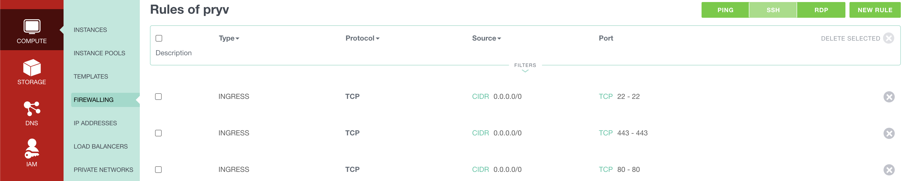
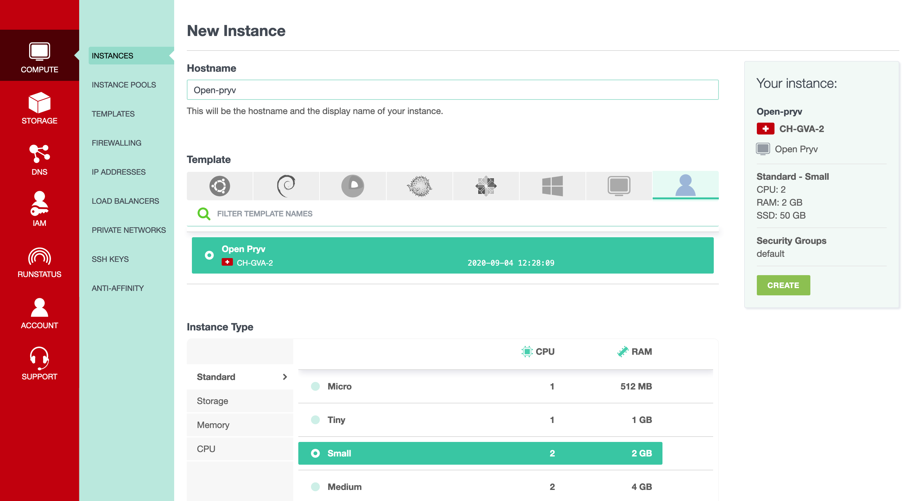
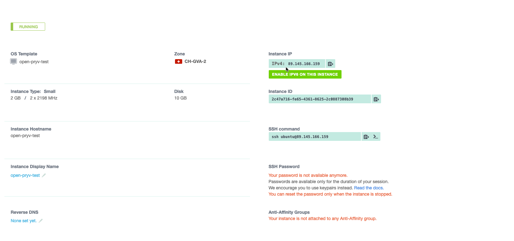
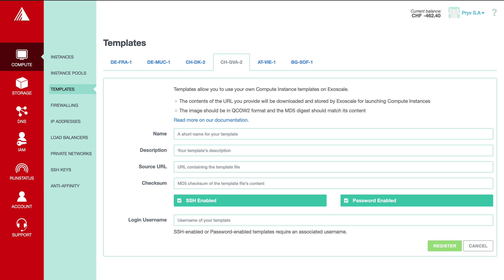

# Image Open-Pryv.io for Exoscale

## Usage
### Setup Instance of the image

#### Create Firewall rules

To create new Firewall rules, click on COMPUTE/FIREWALLING and then click on ADD button. You can create the group `core` and click on create. You can then select the group `core` and add new rules in order it is configured as the screenshot below.



#### Create Instance

To create a new Instance, click on COMPUTE/INSTANCES and then ADD. You can choose the hostname of the machine and make the configuration like the picture below.



Then select the Security Group `core` and copy the content of the snippet bellow by replacing **${HOSTNAME}**, **${DOMAIN}**, **${ACCESS_KEY}** and **${EMAIL}** in the field `User Data` of the form.

```yaml 
#cloud-config
write_files:
- content: |
    {
      "DOMAIN": "${DOMAIN}",
      "EMAIL": "${EMAIL}",
      "KEY": "${ACCESS_KEY}"
    }
  path: /tmp/conf/config.json

runcmd:
 - node /home/ubuntu/setup.js
```


#### DNS Record

When your machine is started, look at the IP address attributed to your machine (see screenshot below) and create an A record in your DNS with the ${DOMAIN} you furnished before.



## Contribute 

### Build Image

To modify the image, add modules, you can modify the file `openpryv/script.sh` and/or add files in `openpryv` and add them in the build by modifying `openpryv/packer.json`.

To build a new image, you need to have a pair of SSH key without password (for example `~/.ssh/exo.pub`and `~/.ssh/exo`)

On MacOS, you have to start a docker deamon and run at the root of the project `PACKER_PUBLIC_KEY=~/.ssh/exo.pub PACKER_PRIVATE_KEY=~/.ssh/exo ./build-docker.sh openpryv`.

On Linux, at the root run `PACKER_PUBLIC_KEY=~/.ssh/exo.pub PACKER_PRIVATE_KEY=~/.ssh/exo ./build.sh openpryv`.

### Create a template

To create a template, you have to host the image on a publicly accessible HTTPS service such as Exoscale [Object Storage](https://community.exoscale.com/documentation/storage/), as you will need to indicate an URL pointing to it during template registration.

If you want to use Exoscale [Object Storage](https://community.exoscale.com/documentation/storage/), you have to install [Exoscale Cli](https://github.com/exoscale/cli), and from inside the Exoscale Cli directory, run `./bin/exo sos upload name_of_bucket PATH_TO_ROOT/output-qemu/openpryv.qcow2`. Then you can connect to the  [Exoscale Console](https://portal.exoscale.com/) and go to Storage. Click on your bucket and you can normally see `openpryv.qcow2`. Click on it, and at the bottom of the page, click on `Quick ACL` and then on `public read`.

To create a new template, you have to connect to your [Exoscale Console](https://portal.exoscale.com/), and go to Compute/Templates. You can select the datacenter of your choice and click on `register`. Then you can indicate the name of the template and the description. You add also the URL to the image and the md5 of the image (run `md5 PATH_TO_ROOT/output-qemu/openpryv.qcow2`). The username is `ubuntu`.

Note that you have to create a new template for each datacenter you want to use.



### Miscellaneous

In `openpryv/openpryv.sh`, a function of update is implemented. Each time we reboot the VM, we make a `git fetch`and `git merge`. To avoid problem with the config file, we give the `--strategy-option ours` to merge.