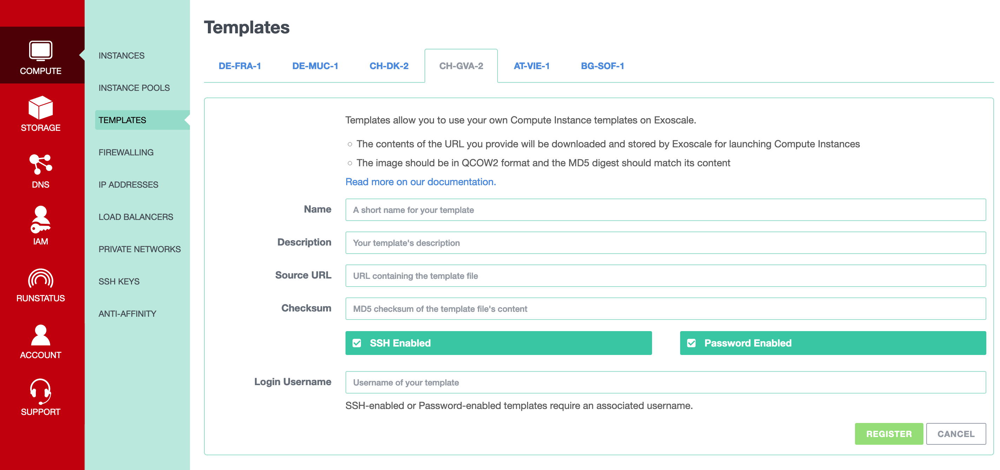

# Open-Pryv.io image for Exoscale

Builds images for Exoscale's [Marketplace](https://www.exoscale.com/marketplace/)

Documentation on how to deploy images is also maintaines in the [docs](docs) folder of this repository and published as a [webpage](https://pryv.github.io/ops-image-exoscale-open-pryv.io/)

## Contribute 

Before publishing this image and branch 

Status: image is building 

- [ ] Test current image
- [ ] Adapt Docker builder 
- [ ] Remove old packer file 
- [ ] Cleanup current task list and status & Merge in master

### How it works

- The image is created with `./build.sh` (linux) or `./build-docker.sh` (Docker based for OSX) 
- The image contains a set of tasks to be run at boot
  1. Install necessary components
  2. Clone Open Pryv.io from Github - So the latest version of Open Pryv.io is installed at first boot
  3. Setup Open Pryv.io environment
  4. Build Open Pryv.io
  5. Run Open Pryv.io
- The image should be uploaded on a HTTP server and published

### Requirements

- An exoscale account on exoscale with a registered SSH key without a password (in the examples `~/.ssh/exo.pub`, `~/.ssh/exo`)
- To upload the image on exoscale:
  - a "bucket" in "storage" (for the example `open-pryv-templates`)
- [Exoscale Cli](https://github.com/exoscale/cli) installed with an **IAM API key** with **write** permission on the bucket. (In the example it's installed under ./cli/)
- On **OSX** you need to have [Docker](https://docs.docker.com/docker-for-mac/install/) installed.

### Build Image

To modify the image or add modules, you can modify the file `openpryv/script.sh` and/or add files in `openpryv/` and add them in the build by modifying `openpryv/build.pkr.hcl`.

- On MacOS, you have to start a docker daemon and run at the root of the project: 

Warning! with Ubuntu 22.04 and Packer 1.6.6 use ssh keys generated with eliptic curves (not RSA)
with: `ssh-keygen -t ed25519` 

The `build.sh` scripts takes care of creating a usable ssk key and the subsequent `user-data` and `seed.img` all stored in `./secrets` 
  
```bash
./build-docker.sh 
```

- On Linux, at the root of the project run: 

```bash
./build.sh 
```

On success the image will be created in `./output-qemu/openpryv.qcow2`

### Upload Image on Exoscale Bucket

Using Exoscale CLI: `path_to_exoscale_cli/exo sos upload open-pryv-templates ./output-qemu/openpryv.qcow2`

Then you can connect to the  [Exoscale Console](https://portal.exoscale.com/) and go to Storage. Click on your bucket and you can normally see `openpryv.qcow2`.

### misc 

Apply license to content with: `npx source-licenser --config-file .licenser.yml ./`

### References

Creating Custom Templates [Using Packer](https://www.exoscale.com/syslog/creating-custom-templates-using-packer/)

To create a template, you have to host the image on a publicly accessible HTTPS service such as Exoscale [Object Storage](https://community.exoscale.com/documentation/storage/), as you will need to indicate a URL pointing to it during template registration. Click on it, and at the bottom of the page, click on `Quick ACL` and then on `public read`.


To create a new template, you have to connect to your [Exoscale Console](https://portal.exoscale.com/), and go to Compute/Templates. You can select the data center of your choice and click on `register`. Then you can indicate the name of the template and the description. You add also the URL to the image and the md5 of the image (run `md5 ./output-qemu/openpryv.qcow2`). The username is `ubuntu`.

Note that you have to create a new template for each data center you want to use.



## Marketplace

- Informations on the [Marketplace & Templates](https://community.exoscale.com/documentation/vendor/marketplace-templates/)  
- Templates [Technical Requirements](https://community.exoscale.com/documentation/vendor/marketplace-templates-tech-requirements/)  

## Publishing Market place documentation page. 

A short documentation on how to deploy the image is published on `gh-pages`.  
The source for this page is located in `./docs/` directory and the paged is build by **jekyll** based on `./docs/README.md`

It will be updated based on the latest version in the `master` branch and accesible by [https://pryv.github.io/ops-image-exoscale-open-pryv.io/](https://pryv.github.io/ops-image-exoscale-open-pryv.io/)

# License

[BSD-3-Clause](LICENSE)
