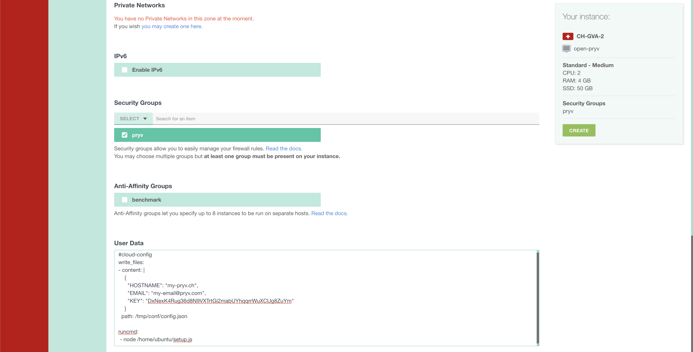

# Image Open-Pryv.io for Exoscale

## Description

This tutorial will guide you to:  

- create a new virtual machine (VM)
- configure the VM with the [OpenPryv.io](https://github.com/pryv/open-pryv.io/) template.

## Requirements

- Account on Exoscale
- DNS zone to define a type-A record

## Usage

### Setup Instance of the image

#### Create Firewall rules

To create new Firewall rules, go to COMPUTE>FIREWALLING and then click on the ADD button. You can create the group `pryv` and click on create. You can then select the group `pryv` and add new rules as shown in the screenshot below.


- TCP 443 is necessary for HTTPS
- TCP 80 is handy for HTTP to HTTPS redirection
- TCP 22 is used for SSH

#### Create Instance

To create a new Instance, go to COMPUTE>INSTANCES and then click on the ADD button. You can choose the hostname of the machine and make the configuration like the picture below.


Then select the Security Group `pryv` and copy the **whole** content of the snippet (you need to include `#cloud-config`) below replacing **${HOSTNAME}**, **${SECRET_KEY}** and **${EMAIL}** in the field `User Data` of the form.  

- **${HOSTNAME}** : Hostname on which your Open-Pryv.io platform is exposed. You will need to define a DNS A record for this hostname.
- **${SECRET_KEY}** : This key must be randomly generated and is used as admin access key
- **${EMAIL}** : This email is only used by Letsencrypt to give you information about your certificate and for recovery purposes ([Link to Letsencrypt](https://letsencrypt.org/fr/privacy/#subscriber)).

```yaml 
#cloud-config
write_files:
- content: |
    {
      "HOSTNAME": "${HOSTNAME}",
      "EMAIL": "${EMAIL}",
      "KEY": "${SECRET_KEY}"
    }
  path: /tmp/conf/config.json

runcmd:
 - node /home/ubuntu/setup.js
```



#### DNS Record

When your machine is started, look at the IP address attributed to your machine (see screenshot below) and create an A record in your DNS zone with the ${HOSTNAME} you furnished before.


### Log

During the setup phase, the script will wait until you add the DNS A record. If you want to know the status of the setup, please connect in ssh inside your VM and read the log file `/home/ubuntu/setup.log`.

### Verify

Now your OpenPryv.io platform is running at `https://${HOSTNAME}/`.  
You should see service information similar to one below:

```
{
  "meta": {
    "apiVersion": "1.5.24-open",
    "serverTime": 1601379119.307,
    "serial": "t1591793506"
  },
  "cheersFrom": "Pryv API",
  "learnMoreAt": "https://api.pryv.com/"
}
```

Follow these steps to start using the platform: [Open Pryv.io - Start](https://github.com/pryv/open-pryv.io#start).

### What next

You can personalize your Open-Pryv and configure company email by following the [README of the git repo of Open-Pryv.io](https://github.com/pryv/open-pryv.io/).

## Contribute 

### Build Image

To modify the image, add modules, you can modify the file `openpryv/script.sh` and/or add files in `openpryv` and add them in the build by modifying `openpryv/packer.json`.

To build a new image, you need to have a pair of SSH key without password (for example `~/.ssh/exo.pub`and `~/.ssh/exo`)

On MacOS, you have to start a docker deamon and run at the root of the project `PACKER_PUBLIC_KEY=~/.ssh/exo.pub PACKER_PRIVATE_KEY=~/.ssh/exo ./build-docker.sh openpryv`.

On Linux, at the root run `PACKER_PUBLIC_KEY=~/.ssh/exo.pub PACKER_PRIVATE_KEY=~/.ssh/exo ./build.sh openpryv`.

### Create a template

To create a template, you have to host the image on a publicly accessible HTTPS service such as Exoscale [Object Storage](https://community.exoscale.com/documentation/storage/), as you will need to indicate an URL pointing to it during template registration.

If you want to use Exoscale [Object Storage](https://community.exoscale.com/documentation/storage/), you have to install [Exoscale Cli](https://github.com/exoscale/cli), and from inside the Exoscale Cli directory, run `./bin/exo sos upload name_of_bucket PATH_TO_ROOT/output-qemu/openpryv.qcow2`. Then you can connect to the  [Exoscale Console](https://portal.exoscale.com/) and go to Storage. Click on your bucket and you can normally see `openpryv.qcow2`. Click on it, and at the bottom of the page, click on `Quick ACL` and then on `public read`.

To create a new template, you have to connect to your [Exoscale Console](https://portal.exoscale.com/), and go to Compute/Templates. You can select the datacenter of your choice and click on `register`. Then you can indicate the name of the template and the description. You add also the URL to the image and the md5 of the image (run `md5 PATH_TO_ROOT/output-qemu/openpryv.qcow2`). The username is `ubuntu`.

Note that you have to create a new template for each datacenter you want to use.


