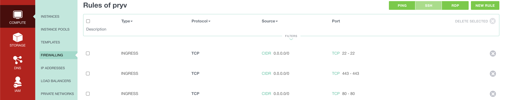
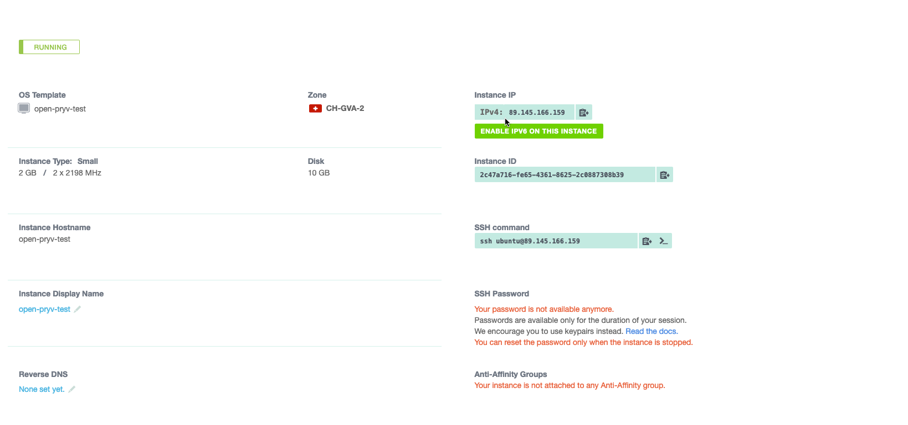

# Open-Pryv.io template for Exoscale

On this page you will find all the necessary information to deploy [Open Pryv.io](https://github.com/pryv/open-pryv.io) from Exoscale's [Marketplace](https://www.exoscale.com/marketplace/).

Please read the following document before launching your first instance.

<center>
<button name="button" onclick="window.location.href='https://portal.exoscale.com/compute/instances/add?template-name=Open%20Pryv.io%20v1.7&instance-type=Small&os-group=other&disk=20'">Launch Open Pryv.io on Exoscale</button><br>
(requires an exoscale account)
</center>

## Preparation

### Hostname

A hostname to be associated with the machine (DNS A record) is required to set-up the SSL termination to the service.

During the installation, you need to know the `hostname` to be assigned to this machine. The setup process will wait for the IP address to be assignated to an A record on your DNS to be completed.

### Firewall rules

To create new Firewall rules, go to COMPUTE>FIREWALLING and then click on the ADD button. You can create the group `pryv` and click on CREATE. You can then select the group `pryv` and add new rules as shown on the screenshot below.



- TCP 443 is necessary for HTTPS
- TCP 80 is handy for HTTP to HTTPS redirection
- TCP 22 is used for SSH

### Create Instance

Select "Open Pryv.io" in the template list and adapt the instance type as per your needs.

Then select the Security Group `pryv` and copy the **whole** content of the snippet (you need to include `#cloud-config`) below replacing **${HOSTNAME}**, **${SECRET_KEY}** and **${EMAIL}** in the field `User Data` of the form.  

- **${HOSTNAME}** : Hostname on which your Open-Pryv.io platform is exposed. You will need to define a DNS A record for this hostname.
- **${SECRET_KEY}** : This key must be randomly generated and is used as the admin access key.
- **${EMAIL}** : This email is only used by Letsencrypt to give you information about your certificate and for recovery purposes ([Link to Letsencrypt](https://letsencrypt.org/fr/privacy/#subscriber)).

```yaml 
#cloud-config
write_files:
- content: |
    {
      "HOSTNAME": "${HOSTNAME}",
      "EMAIL": "${EMAIL}",
      "KEY": "${SECRET_KEY}"
    }
  path: /tmp/conf/config.json

runcmd:
 - node /home/ubuntu/setup.js
```

#### DNS Record

Once your machine is started, look at the IP address attributed to your machine (see screenshot below) and create an A record in your DNS zone with the ${HOSTNAME} you furnished before.



### Log

The first boot can take up to 10 minutes.

To follow the set-up process, connect in ssh inside your VM and read the log file `/home/ubuntu/setup.log`.

```sh
tail -f /home/ubuntu/setup.log
```

During the setup phase, the script will wait until you add the DNS A record. 

### Verify

Your Open Pryv.io platform is now running at `https://${HOSTNAME}/`.  
You should get a service information similar to the one below:

```
{
  "meta": {
    "apiVersion": "1.5.24-open",
    "serverTime": 1601379119.307,
    "serial": "t1591793506"
  },
  "cheersFrom": "Pryv API",
  "learnMoreAt": "https://api.pryv.com/"
}
```

Follow these steps to start using the platform: [Open Pryv.io - Start](https://github.com/pryv/open-pryv.io#start).

### Next steps

You can customize your Open Pryv.io platform and configure company email by following the [README of the git repo of Open-Pryv.io](https://github.com/pryv/open-pryv.io/).


# License

[BSD-3-Clause](LICENSE)
